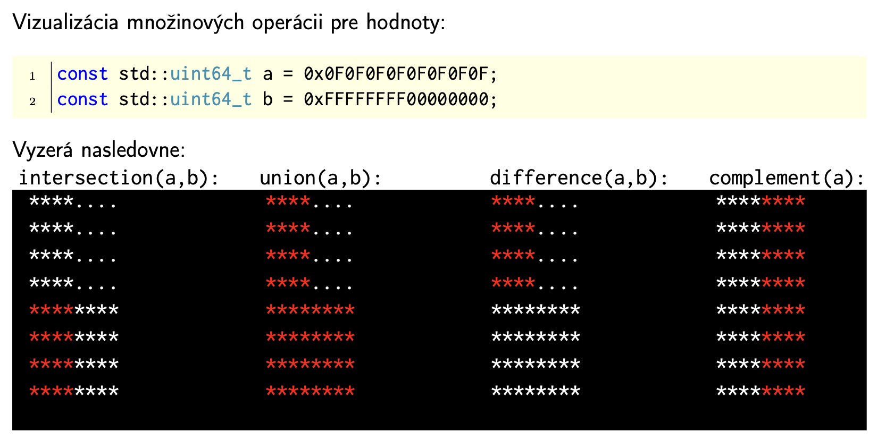
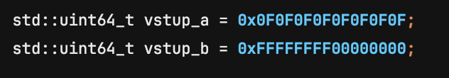

# Set Visualizer (Vizualizátor množín)

Tento projekt je C++ konzolová aplikácia navrhnutá na vizualizáciu základných množinových operácií pomocou bitovej logiky na 64-bitových celých číslach. Aplikácia demonštruje prácu s bitmi a ich grafickú reprezentáciu v termináli.

## Funkcionalita

Program pracuje s dvoma 64-bitovými číslami (reprezentujúcimi dve množiny A a B) a zobrazuje výsledky nasledujúcich operácií:

1.  **Prienik (Intersection)**:
    *   Identifikuje bity, ktoré sú nastavené na 1 v oboch číslach súčasne.
    *   Vo vizualizácii sú tieto spoločné prvky zvýraznené červenou farbou.

2.  **Zjednotenie (Union)**:
    *   Kombinuje bity z oboch čísel (bit je 1, ak je v A alebo v B).
    *   Výsledná množina je kompletne zvýraznená červenou farbou.

3.  **Rozdiel (Difference)**:
    *   Určuje bity, ktoré sú v množine A, ale nie sú v množine B.
    *   Zvýraznené sú iba tie prvky, ktoré patria výlučne do prvej množiny.

4.  **Doplnok (Complement)**:
    *   Invertuje všetky bity vstupného čísla (z 0 na 1 a naopak).
    *   Zobrazí plnú mriežku, kde sú červenou farbou vyznačené bity, ktoré v pôvodnom čísle neboli nastavené.

## Zobrazenie

Dáta sú vizualizované ako mriežka **8x8**, kde každý bod zodpovedá jednému bitu zo 64-bitového čísla.
*   `*` (hviezdička) predstavuje aktívny bit (hodnota 1).
*   `.` (bodka) predstavuje neaktívny bit (hodnota 0).
*   Výsledky operácií sú pre lepšiu prehľadnosť farebne odlíšené priamo v termináli.

